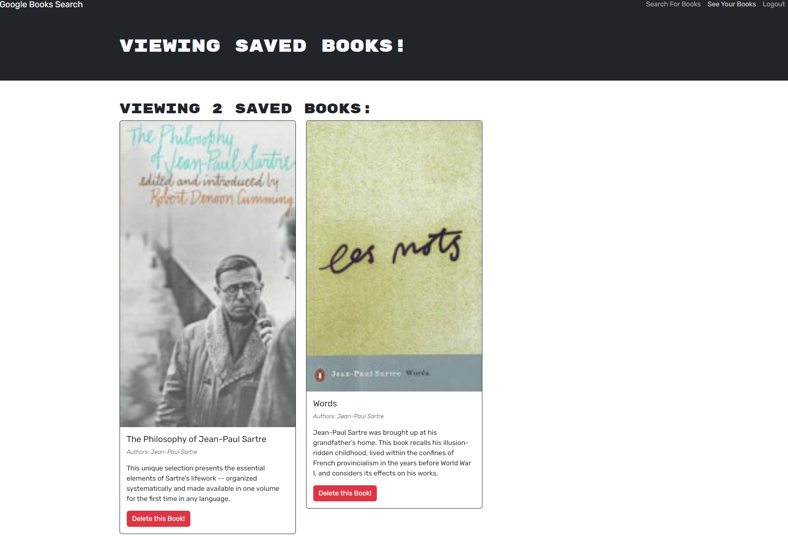
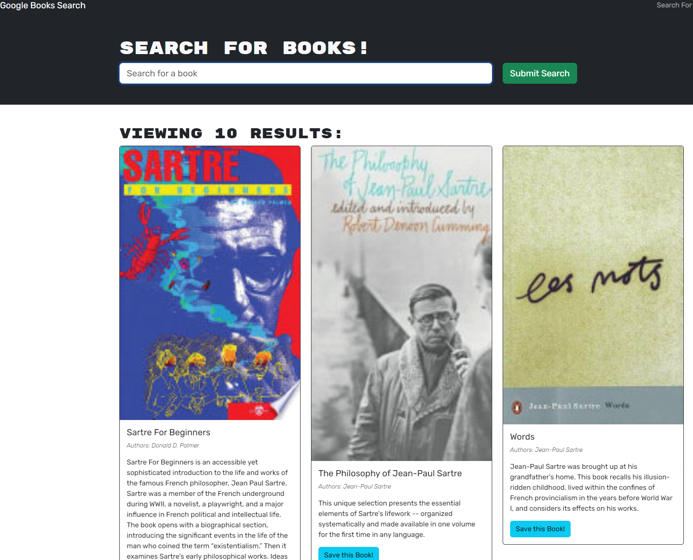

# Book-Search-Engine

## Description
The Books Search Engine, built on the MERN stack, offers users a platform to effortlessly search for books. On accessing, users can browse book details from Google Books. Registered members enjoy additional features: they can save favorites to their personal list, revisit them later, and remove as desired. Simplified, personalized, and efficient, this engine caters to all book enthusiasts.

### Credits

Completion of the project was done with the help of Tutors

